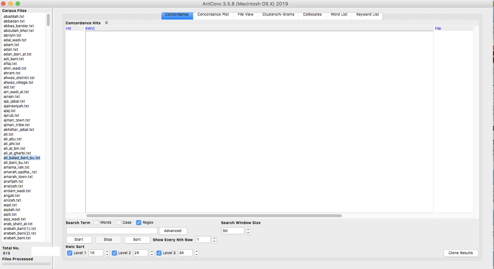
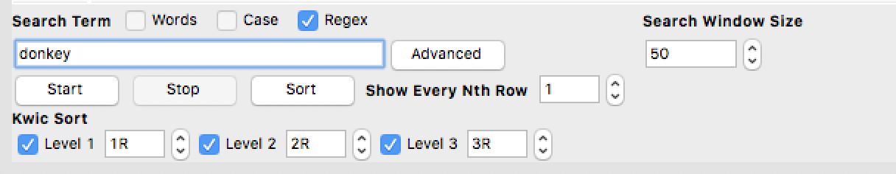
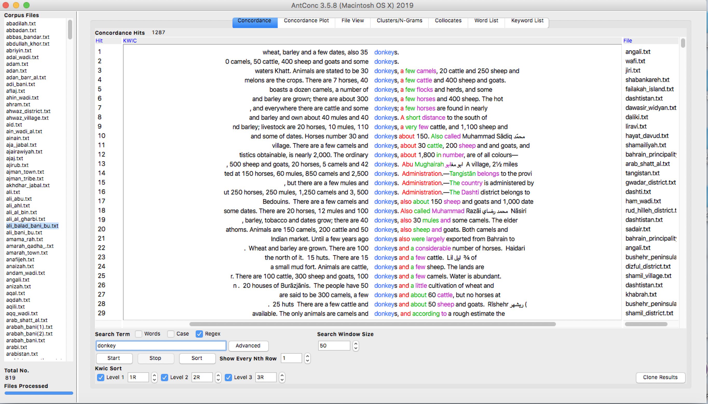
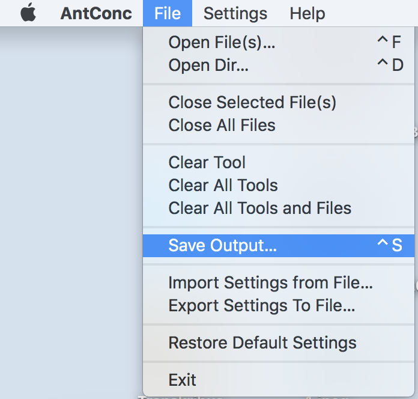
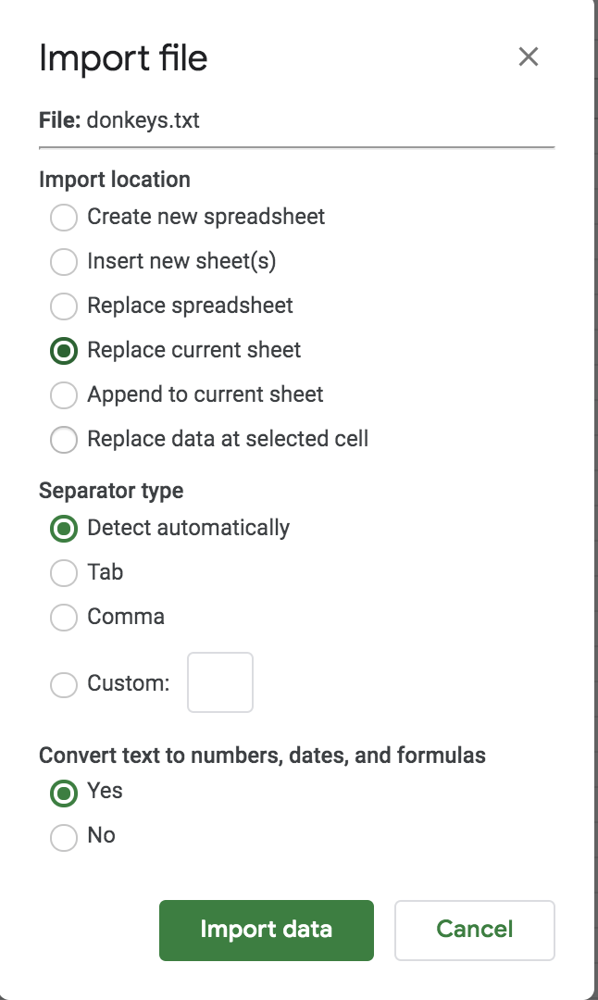
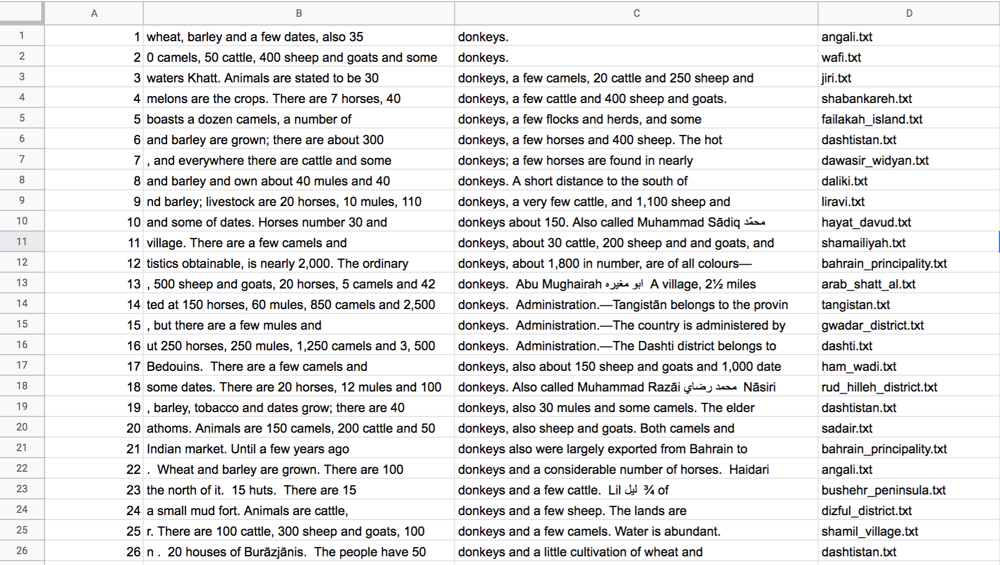
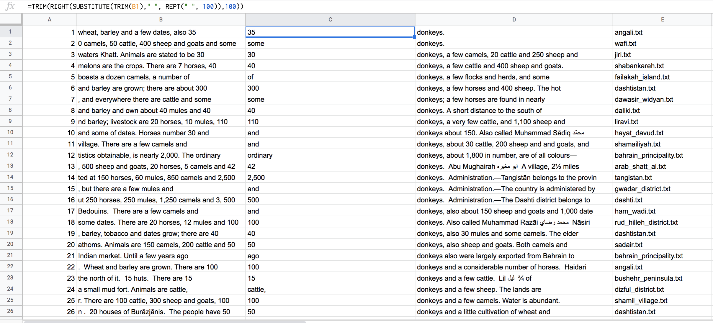
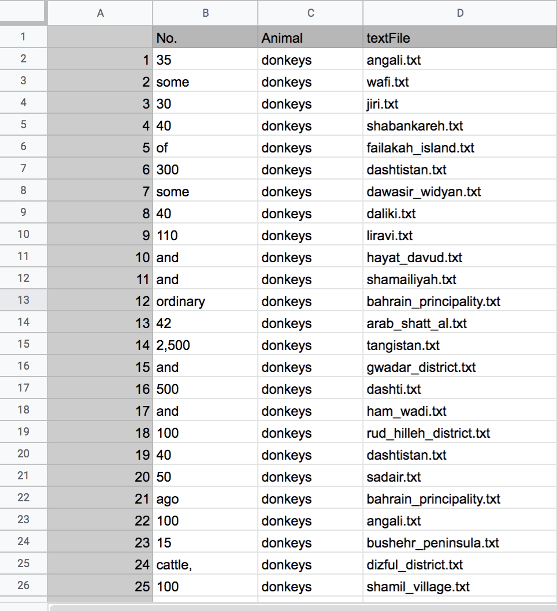

### Extracting Repeated Quantities from Plain Text Files Using AntConc and Formulas in Google Sheets 

_By Liyan Ibrahim_

When creating historical data for map-making, structured datasets makes the process easier and cleaner. This blog will provide a detailed tutorial on how to extract quantities of a certain attribute from a collection of text files using low-barrier digital platforms: AntConc and Google Sheets. In this tutorial, I will be extracting the number of donkeys mentioned in each text file. 	

- Download all the text files into one folder. 

- Import all the text files into AntConc File → Open Directory and navigate to the same folder with the text files and import them.Once these files are imported, AntConc should look like this:

Note that: All the text file names are seen in the left hand window named “Corpus Files” and the total number of files is seen under “Total No.” at bottom left. Now that AntConc is setup, insert a search term to search for your desired attribute as shown

- Now that AntConc is setup, use the search term to search for your desired attribute as shown

	
- AntConc will generate a screen as follows with the search term and the total number of concordance hits (that is, the total occurrences  of “donkey” found) is seen in the upper left corner and the corresponding file name for each result on the right side

	
- Since AntConc provides the data in a consistent KWIC (keyword in context) format, we can save the output for further manipulation as a text file by going to File → Save Output as shown
	

- For extracting the entities and the quantities the txt file  saved from AntConc can now be imported into GoogleSheets using File → Import → Upload

- Since the txt file has tabs separating what were previously Columns in AntConc, Google sheets can detect that automatically and place the same values into columns. The following settings should be chosen for the data to be imported correctly

- Google Sheets should now look like this

- Since the quantity we want to extract is in column B, insert a new empty column between B and C.

- It is also important to note that, since our data is consistent, the number we want in almost always present at the end of the sentence in column B.

- We can now use a formula to extract the last word/number from column B
	
- If you have consistent spacing, use the following formula, replacing text with the cell containing the value (in my case, B1) : =TRIM(RIGHT(SUBSTITUTE(text," ",REPT(" ",100)),100)) 

- If you have inconsistent spacing, use the following formula, replacing text with the cell containing the value (in my case, B1): =TRIM(RIGHT(SUBSTITUTE(TRIM(text)," ", REPT(" ", 100)),100))
					
- Replicate for the rest of the cells and the output should be as shown 

### OPTIONAL: 

To further clean up the data, choose a format in which only the relevant content is in the sheet. For my case, we only needed the number of donkeys and the file name. The following is the data after cleaning it

