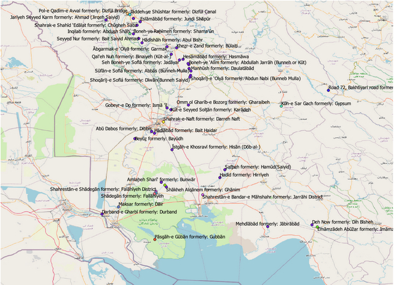

## Place Name Changes in Arabistan (Khuzestan)

Everett Pruitt

Place names in Khuzestan, a region of Iran, have changed tremendously over the last century. OpenGulf can help track these changes through its data from Lorimer’s <a href="https://archive.org/details/in.ernet.dli.2015.206963" class="link">Gazetteer of the Persian Gulf, Oman and Central Arabia</a>, compiled and published in the late nineteenth and early twentieth century and declassified in the 1950s. The existing, and very scarce, literature surrounding place names in Iran portrays the politics of place names as contentious and highly politicized. The literature I found starts with the period of the Pahlavi regime, arguing that it <a href="https://www.jstor.org/stable/215071" class="link">forcefully renamed cities in the 1930s</a> to cement its legacy in the geographic fabric of the country. This narrative continues after the Islamic Revolution in 1979, with Iranians beginning <a href="https://www.jstor.org/stable/215071" class="link">reverting to some pre-Pahlavi place names</a>. The Iranian government also renamed places in the service of its <a href="https://www.jstor.org/stable/215071" class="link">own ideological revolution</a> and included the erasure of ethnic minorities’ identities by <a href="https://www.jstor.org/stable/215071" class="link">changing place names into Persian names</a>. The data from OpenGulf represents a unique opportunity to examine this narrative in a thorough and complete manner. At this time, I am unaware of any significant data on the changes in place names in Iran. The data compiled by OpenGulf could be used to create a detailed analysis of name changes in Khuzestan and the Persian Coast, both regions with a significant Arab population in Iran.

Even in its presently incomplete state, the OpenGulf data on Arabistan can begin to address this gap. Below, I have compiled a map showing the present names of places and their names that appear in Lorimer. Some obvious examples of political name changes stand out, such as Abdush Shah, slave of the Shah in Arabic, to Inqilab, Farsi for revolution, Fallahiyeh, a name derived from the Arabic word for farming, to Shadegan, Shahabad, or place of the Shah, to Islamabad, or place of Islam. While this is a cursory look at the data, it demonstrates the potential of the OpenGulf data as a foundation for a history of place name changes in Khuzestan and the Persian Coast.

Figure 1: A map showing localities labelled with their current name and former names.

The data in this map is derived from the work that we know as Lorimer’s Gazetteer of the Persian Gulf, Oman and Central Arabia by matching the descriptions of cities to their contemporary equivalents. The dataset of names can be found

<a href="https://github.com/opengulf/Lorimer_data/blob/master/name_changes_Arabistan.csv" class="link">here</a>

Suggested citation: 

